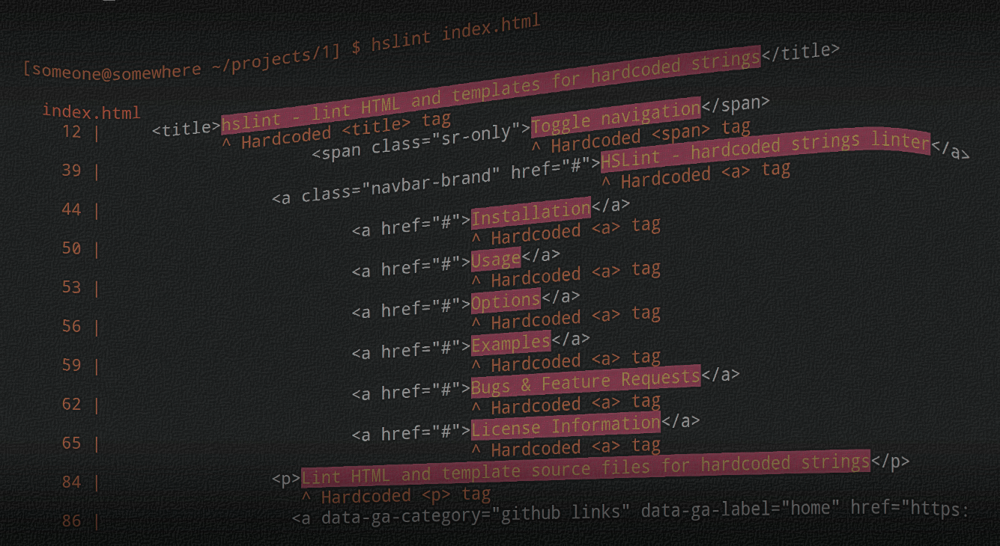

# grunt-i18nlint [](http://badge.fury.io/gh/jwarby%2Fgrunt-i18nlint)

[](https://travis-ci.org/jwarby/grunt-i18nlint)
[](https://david-dm.org/jwarby/grunt-i18nlint)
[](https://david-dm.org/jwarby/grunt-i18nlint#info=devDependencies)

> An opinionated Grunt task for finding hardcoded, untranslated strings in HTML and template source files



## Getting Started
This plugin requires Grunt.

If you haven't used [Grunt](http://gruntjs.com/) before, be sure to check out the [Getting Started](http://gruntjs.com/getting-started) guide, as it explains how to create a [Gruntfile](http://gruntjs.com/sample-gruntfile) as well as install and use Grunt plugins. Once you're familiar with that process, you may install this plugin with this command:

```shell
npm install grunt-i18nlint --save-dev
```

Once the plugin has been installed, it may be enabled inside your Gruntfile with this line of JavaScript:

```js
grunt.loadNpmTasks('grunt-i18nlint');
```

## The "i18nlint" task

The task assumes that your translation keys are similar in form to `'my.amazing.key'`.  The task can be used to
detect potentially hardcoded strings in element text nodes, and optionally from a list of HTML attributes (think
`alt`, `title`, etc.).

### Overview
In your project's Gruntfile, add a section named `i18nlint` to the data object passed into `grunt.initConfig()`.

```js
grunt.initConfig({
  i18nlint: {
    options: {
      // Task-specific options go here.
    },
    your_target: {
      // Target-specific file lists and/or options go here.
    },
  },
})
```

### Options

#### options.attributes
Type: `Array`
Default value: `['alt', 'title']`

An array of HTML attributes which should be checked for hardcoded strings.  To disable attribute checking, set this to an empty array or
a falsy value.

#### options.ignoreTags
Type: `Array`
Default value `['script', 'style']`

An array of HTML elements to ignore when searching for hardcoded strings.

#### options.templateDelimiters
Type: `Array`
Default value: `[]`

An array which is to contain the start and end delimiters of the templates to be scanned.  Content within template delimiters is ignored.

##### Examples

###### EJS

```js
grunt.initConfig({
  i18nlint: {
    options: {
      templateDelimiters: ['<%', '%>']
    },
    src: 'myproject/**/*.ejs'
  }
});
```

###### Mustache-like

```js
grunt.initConfig({
  i18nlint: {
    options: {
      templateDelimiters: ['{{', '}}']
    },
    src: [
      'mymodule1/**/*.hbs',
      'mymodule2/**/*.hbs'
    ]
  }
});
```

#### options.reporter
Type: `String` or `Function`
Default value: `i18nlint.reporters.default`

- Set the i18n-lint reporter to use when outputting linting results.  If a function is provided, it will be called for each input file, with an array
  containing the errors for found for the file.
- If a string is provided, it must be a valid path or module name that can be `require`'d, and required file must export
  a `reporter` property.  The `reporter` property should be a function as described above

See the [i18n-lint Documentation](https://jwarby.github.io/i18n-lint) or visit [i18n-lint on GitHub](https://github.com/jwarby/i18n-lint)
for more information on reporters and error object descriptions.

#### options.force
Type: `Boolean`
Default value: `false`

Force Grunt to carry on running even if the task fails.

### Usage Examples

#### Default Options
In this example, the default options are used, which means the task will check text nodes, `alt` attributes and `title` attributes:

```js
grunt.initConfig({
  i18nlint: {
    src: '**/*.html'
  },
})
```

#### Custom Options
In this example, attribute checking is disabled, and EJS templating is used:

```js
grunt.initConfig({
  i18nlint: {
    options: {
      templateDelimiters: ['<%', '%>'],
      attributes: null
    },
    src: 'test/fixtures/*.ejs'
  }
})
```

## Contributing
In lieu of a formal styleguide, take care to maintain the existing coding style. Add unit tests for any new or changed functionality. Lint and test your code using [Grunt](http://gruntjs.com/).

## Bugs and Feature Requests

Please raise all bugs and feature requests on the [issue tracker](https://github.com/jwarby/grunt-i18nlint/issues).

## Release History
_(Nothing yet)_

## License
Copyright (c) 2015 James Warwood. Licensed under the MIT license.
